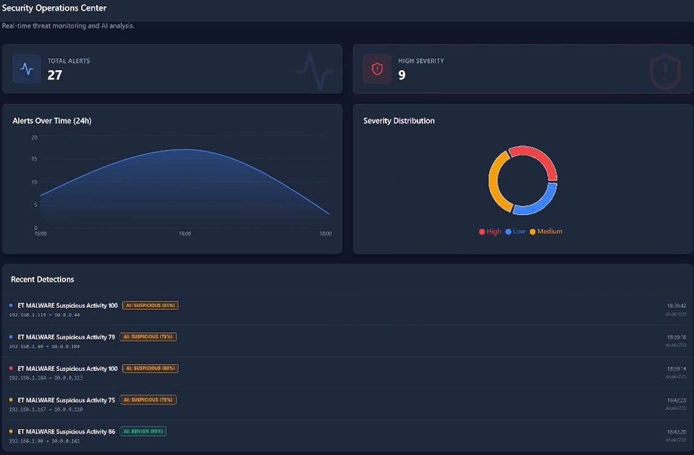
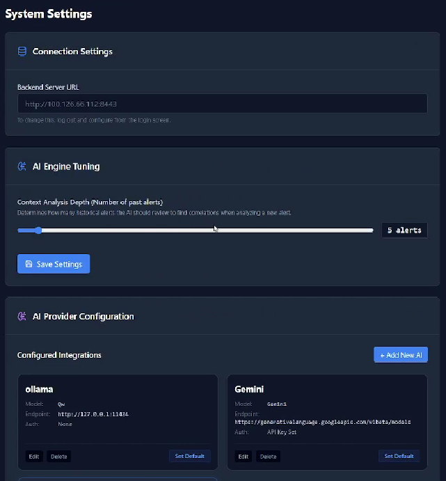

# ThreatHunter SIEM

A modern, lightweight Security Information and Event Management (SIEM) platform designed for real-time security monitoring, alert management, endpoint telemetry, and AI-assisted threat analysis.

## Overview

ThreatHunter SIEM provides a centralized platform for collecting security telemetry from endpoint agents, detecting and monitoring security events, and investigating alerts through a modern web dashboard.

The system is designed with a modular architecture consisting of three main components:

* **SIEM Server** — Backend API, database, authentication, WebSockets, and AI integration.
* **Frontend** — React-based dashboard for monitoring and managing the SIEM.
* **SIEM Agent** — Lightweight endpoint agent responsible for collecting and forwarding telemetry.

## Architecture

```text
                    ┌─────────────────────┐
                    │    SIEM Dashboard   │
                    │   React + Vite      │
                    └──────────┬──────────┘
                               │
                         REST / WebSocket
                               │
                    ┌──────────▼──────────┐
                    │     SIEM Server     │
                    │ FastAPI + Database  │
                    │   AI Integration    │
                    └──────────┬──────────┘
                               │
                         Secure API
                               │
              ┌────────────────┼────────────────┐
              │                │                │
       ┌──────▼──────┐  ┌──────▼──────┐  ┌──────▼──────┐
       │ SIEM Agent  │  │ SIEM Agent  │  │ SIEM Agent  │
       │  Endpoint   │  │  Endpoint   │  │  Endpoint   │
       └─────────────┘  └─────────────┘  └─────────────┘
```

## Project Structure

```text
ThreatHunter-SIEM/
│
├── siem-server/
│   ├── app/
│   ├── api/
│   ├── database/
│   ├── migrations/
│   ├── requirements.txt
│   └── README.md
│
├── frontend/
│   ├── src/
│   ├── public/
│   ├── package.json
│   └── README.md
│
├── siem-agent/
│   ├── storage/
│   ├── transport/
│   ├── main.py
│   ├── requirements.txt
│   └── README.md
│
└── README.md
```

## Components

### SIEM Server

The server provides the central backend for the platform.

**Technologies:**

* Python
* FastAPI
* SQLite / PostgreSQL
* SQLAlchemy
* Alembic
* WebSockets

**Responsibilities:**

* Receive endpoint telemetry
* Store security events
* Manage agents
* Authenticate users
* Manage permissions
* Process alerts
* Provide REST APIs
* Stream real-time events
* Integrate with AI services

[Server Setup Guide](./siem-server/README.md)

---

### Frontend

The frontend provides the main SOC dashboard used to monitor and investigate security events.

**Technologies:**

* React
* Vite
* Tailwind CSS

**Capabilities:**

* Real-time alert monitoring
* Alert investigation
* Agent management
* System monitoring
* AI-assisted investigation
* Incident reporting
* Authentication and access control

[Frontend Setup Guide](./frontend/README.md)

---

### SIEM Agent

The SIEM Agent runs on monitored endpoints and communicates with the central SIEM server.

**Technologies:**

* Python
* SQLite
* REST API

**Responsibilities:**

* Collect endpoint telemetry
* Queue events locally when the server is unavailable
* Forward queued events when connectivity is restored
* Communicate securely with the SIEM server
* Maintain endpoint state

[Agent Setup Guide](./siem-agent/README.md)

## Features

### Real-Time Monitoring

Security events and alerts can be streamed from the backend to the dashboard in real time using WebSockets.

### AI-Powered Threat Analysis

The platform integrates AI-assisted analysis to help investigate suspicious events and provide contextual explanations for security alerts.

### Alert Investigation

Security analysts can inspect individual alerts and review relevant event information from the dashboard.

### Agent Management

Connected endpoint agents can be monitored and managed from the central dashboard.

### Incident Reports

Security incidents can be exported into PDF reports for documentation, compliance, and investigation records.

### Authentication & Permissions

The platform supports authenticated access and role-based permissions for controlling access to SIEM functionality.

### Modern SOC Dashboard

The dashboard is designed for security operations workflows with a dark interface, real-time data, alert views, and investigation tools.

## Screenshots

### Main Dashboard



### Alert Details


### AI Chat


### Settings



## Getting Started

Clone the repository:

```bash
git clone https://github.com/7jap/SOC-Ai.git
cd SOC-Ai
```

Follow the setup instructions for each component:

### Server

See:

```text
siem-server/README.md
```

### Frontend

See:

```text
frontend/README.md
```

### Agent

See:

```text
siem-agent/README.md
```

## Development

ThreatHunter SIEM is structured as separate services so that the server, frontend, and endpoint agent can be developed and deployed independently.

This architecture allows additional agents, detection capabilities, AI providers, and dashboard functionality to be added without tightly coupling the entire system.

## Roadmap

* [ ] Advanced detection rules
* [ ] Expanded endpoint telemetry
* [ ] MITRE ATT&CK mapping
* [ ] Improved AI investigation workflows
* [ ] Additional AI providers
* [ ] Advanced correlation engine
* [ ] Enhanced incident response workflows
* [ ] Additional reporting capabilities

## License

This project is licensed under the MIT License.
